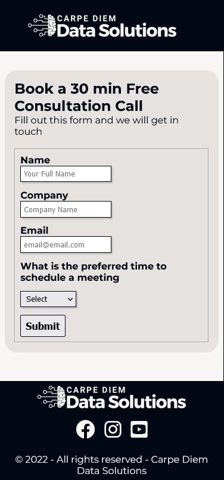
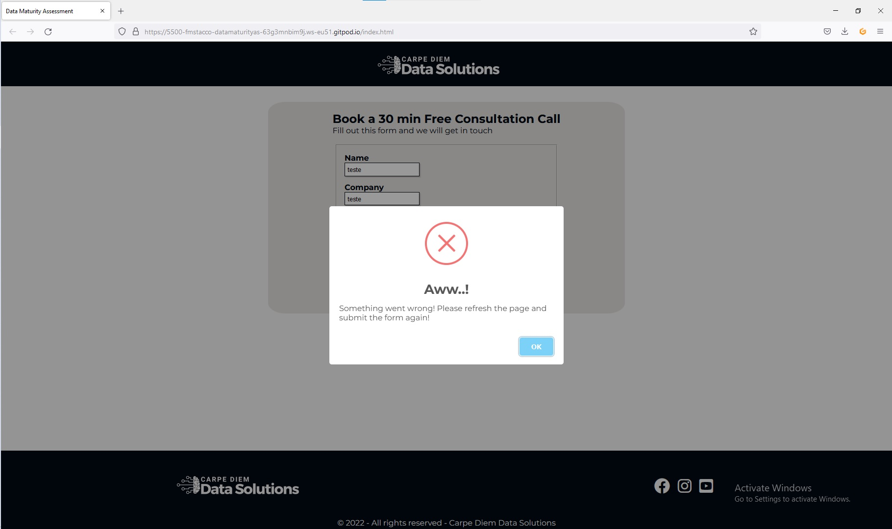
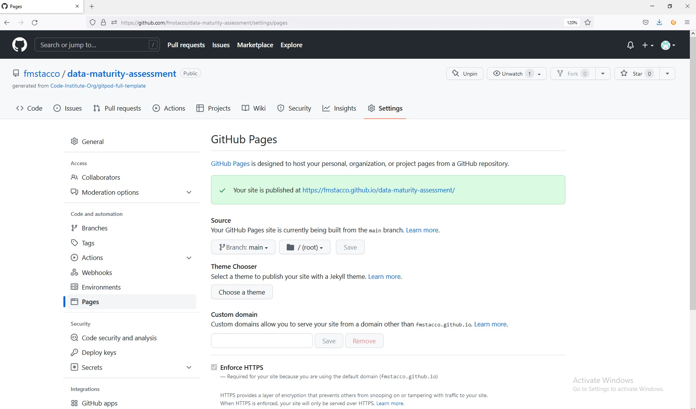

# **Data Maturity Assessment - Project Portfolio 2 - JavaScript**

Data Maturity Assessment is a tool that will help small and medium -sized companies evaluate the maturity level of their data management. This evaluation will indicate at what stage the company is in data management as well as ways to improve company data maturity. The idea of this quiz was on the future features list of the [Project Portfolio 1](https://github.com/fmstacco/Carpe-Diem-Data-Solutions), therefore, this project inherits the style and some of the same code for some sections, such as logo, typography, footer, form among others.  

Welcome to the live site here: <a href="https://fmstacco.github.io/data-maturity-assessment/" target="_blank">Data Maturity Assessment</a>

# Contents

* [**Objective**](<#objective>)
* [**User Experience UX**](<#user-experience-ux>)
    * [Target Audience](<#target-audience>)
    * [User Stories](<#user-stories>)
    * [Wireframes](<#wireframes>)
    * [Site Structure](<#site-structure>)
    * [Design Choices](<#design-choices>)
    *  [Logo](<#logo>)
    *  [Typography](<#typography>)
    *  [Colour Scheme](<#colour-scheme>)
* [**Features**](<#features>)
    * [Welcome Screen](<#welcome-screen>)
    * [Quiz Screen](<#quiz-screen>)
    * [Results Screen](<#results-screen>)
    * [Form Screen](<#form-screen>)
    * [Form Destination Page](<#form-destination-page>)
    * [404 Page](<#404-page>)   
* [**Future Features**](<#future-features>)
* [**Technologies Used**](<#technologies-used>)
* [**Testing**](<#testing>)
* [**Deployment**](<#deployment>)
* [**Credits**](<#credits>)
    * [**Content**](<#content>)
    * [**Media**](<#media>)
*  [**Acknowledgements**](<#acknowledgements>)

# Objective 

This project aims to deliver an interactive website where potential customers - small and medium -sized companies - will be able to self -assess the maturity level of their company data management.

# User Experience (UX)

## Target Audience

* Users (potential customers) to evaluate your company's data management.
* Users (potential customers) want to know the metrics used to evaluate the maturity of the company's data management.

## User Stories

* As a potential customer, I want to easily navigate the data maturity assessment quiz.
* As a potential customer, I want to know where I am getting it right and where I am missing the data management of my company.
* As a potential customer, I want to receive feedback from my assessment of my company's data maturity.
* As a potential customer, I want to be able to contact the company to learn more about the company services.

[Back to top](<#contents>)

## Wireframes

The wireframes for Data Maturity Assessment on [Balsamiq](https://balsamiq.com). They are of low fidelity as there have been modifications throughout the development of the website. 

<b>Welcome Page Wireframe</b>

<b>Quizz Page Wireframe</b>

<b>Score Page Wireframe</b>

[Back to top](<#contents>)

## Site Structure

Carpe Diem Maturity assessment website has three main screens. The welcome screen - the default loading page. The quiz screen and the results screen. The contact form screen, is only displayed if the user clicks on the button "Contact Us", which in turns leads the user to the form destination page in case the form submission is successful.  

[Back to top](<#contents>)

## Design Choices

 * ### Logo

 The logo was designed on [Canva](https://www.canva.com/en_gb/) version Pro. A machine learning icon was chosen to convey the core concept of business consulting - data analysis and data science. The logo is borrowed from PP1 - Carpe Diem Data Solutions, as this project was thought to be a continuity of [Project 1](https://github.com/fmstacco/Carpe-Diem-Data-Solutions). 

 

 * ### Typography
 
 The source used throughout the site is Montserrat, as it is a nice font, elegant and also conveys confidence and professionalism. It is very good for UX/UI for having good readability on any device, large x-heigh and is also good for accessibility. Also the typography is borrowed from PP1 - Carpe Diem Data Solutions, as this project was thought to be a continuity of [Project 1](https://github.com/fmstacco/Carpe-Diem-Data-Solutions). 

 * ### Colour Scheme

Colour Palette image

The colour palette idea is borrowed from PP1 - Carpe Diem Data Solutions, as this project was thought to be a continuity of [Project 1](https://github.com/fmstacco/Carpe-Diem-Data-Solutions). 

# Features

## Welcome Screen

* This is the Data Maturity Assessment main page which has the instructions leading to the button for the Complete Assessment.

* There is the hover effect on Complete Assessment button to improve the user experience, which changes the background and font colors.

Please click on the links below to see the images of the **Welcome Screen**:

<b>Welcome Screen - Image Mobile</b>

[Back to top](<#contents>)

## Quiz Screen

This is the Quiz Screen:
* The are 22 questions with one correct answer. 
* The questions and options are displayed randomly.
  

* The button next just is displayed when the user selects an answer.
* The correct answer is displayed in green and the wrong answer in red.

Please click on the links below to see the **Quiz Screen  image for mobile**:

<b>Mobile Quiz Screen Image</b>

[Back to top](<#contents>)

## Results Screen

This is the Quiz Result Screen. 

* There are three possibilities of result: Congratulations!; Not Bad and Awn... 
* There are three buttons, so the user can choose if he/she wants to restart the quiz, go to home page or to get in touch. 

Result: Congratulations

Result: Not Bad

Result: Awn

Please click on the links below to see the **Quiz Result Screen for mobile**:

<b>Quiz Result Screen for mobile</b>

[Back to top](<#contents>)

## Form Screen

This is the form screen. It is a screen where the potential customer can get in touch by sending on informations such as name, company name, email and preferred time to book a free consultation session.

Please click on the links below to see **Form Screen image for mobile**:

<b>Form Screen image for mobile</b>

The form is sending email and collecting potential customer details through [EmailJS](https://www.emailjs.com/)

[Back to top](<#contents>)

## Form Destination Page

The Form Destination Page presents a feedback regarding the submitted form so the potential client know that the form was submited and that we will get in touch quickly to book the 30 minutes free consultation. It contributes for the user experience UX/UI. 

Please click on the links below to see the **Form Destination Page image for mobile**:

<b>Form Destination Page - Image Mobile</b>

Unsucessful submissions will see the message below. It contributes for the user experience UX/UI. 

[Back to top](<#contents>)

## 404 Page

A 404 page was designed to also improve the user experience linking them back to the home page.

<b>404 Page - Image Mobile</b>

[Back to top](<#contents>)

# Future Features

The Data Maturity Assessment can be improved in the future through new features to be developed:

**Progress Bar** - A ***progress bar*** is a nice feature to show how far the user is in the process of answering the questionnaire. And is good for a better user experience.

**Short Assessment** - a ***quick*** assessment with fewer questions could be implemented in order to address potential customers who don’t have the time to answer the complete assessment. 

**Login** - for future development it would be nice to have a ***signup and login*** feature in order for the user to get the results. It would be great for the business to expand its mailing list of potential clients to offer its services. 

**404 Page** - it can be improved for better user experience UX/UI. 

# Technologies Used

* [HTML5](https://en.wikipedia.org/wiki/HTML#HTML_5) - to provide the content and structure for the website.
* [JavaScript](https://developer.mozilla.org/en-US/docs/Web/JavaScript) - provides the interactivity to the site.
* [Balsamiq](https://balsamiq.com/wireframes/) - to create the wireframes for the website.
* [Canva](https://www.canva.com/en_gb/) - to create the logo, color palete and multi device website mockup (Pro version) .
* [CSS](https://en.wikipedia.org/wiki/CSS) - to provide the styling for the website.
* [Gitpod](https://www.gitpod.io/#get-started) - to edit and develop the website.
* [Gitbash](https://en.wikipedia.org/wiki/Bash_(Unix_shell)) - to push changes to the GitHub repository.
* [Github](https://github.com/) - to host and deploy the website.
* [Google Fonts](https://fonts.google.com/) - to import the 'Inter' font into the style.css file.
* [Lighthouse](https://developers.google.com/web/tools/lighthouse) - to test the quality of the website.
* [W3C CSS Validator](https://jigsaw.w3.org/css-validator/) - to validate the CSS.
* [W3C HTML Validator](https://validator.w3.org/) - to validate the HTML.
* [JSHint](https://jshint.com/) - to validate JavaScript.

[Back to top](<#contents>)

# Testing

### Code Validation

The Carpe Diem Data Maturity Assessment has gone through intensive tests throughout its pages and sections/screens. The [W3C CSS Validator](https://jigsaw.w3.org/css-validator/) were used to validate the CSS, [W3C HTML Validator](https://validator.w3.org/) were used to validate the HTML and [JSHint](https://jshint.com/) to validate JavaScript. Minor errors returned and were fixed and then no errors returned.

**HTML validation** 

* Website Data Maturity Assessment

 

**CSS validation image**

 

**JavaScript validation image**

 

### Responsiveness Test

Carpe Diem Data Maturity Assessment was manually tested for his responsiveness with [Google Chrome DevTools](https://developer.chrome.com/docs/devtools/) and [Responsive Design Checker](https://www.responsivedesignchecker.com/).

|        | Nexus 4/5/6 | Galaxy S5/S6/S7 | iPhone 6--12 | iPad |  Display <1200px | Display >1200px |
|--------|-------------|-----------------|--------------|------|------------------|-----------------|
| Render |    pass     |      pass       |     pass     | pass |     pass         |      pass       |
| Images |    pass     |      pass       |     pass     | pass |     pass         |      pass       |
| Links  |    pass     |      pass       |     pass     | pass |     pass         |      pass       |

### Manual Testing

The Data Maturity Assessment has been extensively tested in different devices. It was checked features, responsiveness, accessibility, layout, design, texts, buttons and navigation links, form submission on different browsers.

### Testing User Stories

| Expectation                         | Result                          |
| :---------------------------------: | :------------------------------:|
| As a potential customer, I want to easily navigate the data maturity assessment quiz. **[Quiz Website]** | The potential customer can easily navigate through the site and its buttons on the home, quiz, quiz result, form, form destination page and 404 page. User can return to home screen easily through buttons and links.|
| As a potential customer, I want to know where I am getting it right and where I am missing the data management of my company. **[Quiz Screen]**| On the quiz screen, the user knows which question he was right and which question was wrong through the green and red colors that appear when he gets it right and wrong, respectively.|
| As a potential customer, I want to receive feedback from my assessment of my company's data maturity. **[Results Screen]**|On the results screen, the user will know his score and will receive feedback on how he did and what the next steps are. |
| As a potential customer, I want to be able to contact the company to learn more about the company services.**[Contact Screen]**| By clicking on the Contact Us button on the results screen, the potential client will be able to get in touch by sending their contact details, name, email, company name and best time to contact. |
| As a potencial customer, I want to know that my form was received and they will get in touch with me quickly.**[Form Destination Page]** | When submitting the form, the user will be directed to the submission confirmation page with the information that we will contact you shortly.|

### Browser Testing

The Carpe Diem Data Maturity Assessment was manually tested on these browsers as table below and design, layout, functionality and responsiveness were  consistent across all browsers both mobile and desktop.

|   Browser   |    Result  | 
| :---------: | :---------:| 
| Chrome      |   pass     | 
| Edge        |   pass     |
| Firefox     |   pass     |
| Safari      |   pass     |
| IE          |   pass     | 

### Bugs Fixed 

During the website testing process some smaller errors appeared on the home page and service page and were immediately corrected. The HTML and CSS validation process occurred throughout the construction of the website. In this way, misconceptions as a lack of the **alt** element in the image, image size and  closing tag were corrected quickly.

* Home page 
    
    

* Services page

    

## Additional Testing

### Acessibility 

To check the accessibility in color regarding was used the [A11y](https://color.a11y.com/).

 

### Lighthouse

A test on [Google Lighthouse](https://developers.google.com/web/tools/lighthouse) was also done through  Chrome Developer Tools.

It tests each of the pages for ***performance, acessibility, best practices and SEO***

[Back to top](<#contents>)

# Deployment 

### **To deploy this project**

This website was deployed to Github by following the steps below:

1. In the Github repository for this project navigate to the ***settings*** tab.
2. On the left side of the page, scroll down and navigate to the ***pages*** tab.
3. Under the ***source*** tab, select the branch called ***main*** and select the folder called ***root***.
4. The page will automatically refresh, with a message that the website has been launched and after about five minutes is possible to obtain the link to the deployed website.

This is the link to the Github repository: https://github.com/fmstacco/data-maturity-assessment

[Back to top](<#contents>)

### **To fork this repository on GitHub**

A fork of this repository can be made which will allow you to make changes on this project without affecting the original repository. 

The steps below should be followed to ***fork*** a respository:

1. Log in to ***GitHub*** and find the [repository](https://github.com/fmstacco/data-maturity-assessment).

2. Click on the button ***fork*** on the right hand side of the page to create a copy of the original repository in your GitHub Account.

See the image below:

[Back to top](<#contents>)

### **To create a local clone of this project**

The steps below should be followed to ***clone*** a respository:

1. On the repository’s page, click on the ***code*** tab.
2. On the ***Clone with HTTPS*** tab, click on the icon (see image below) to copy the URL.

3. Open ***Git Bash*** on your IDE terminal.
4. Change the current working directory to the location where you want the cloned directory.
5. Type ***git clone***, and then paste the URL copied from GitHub.

Type: git clone + https://github.com/fmstacco/data-maturity-assessment.git

6. Press ***enter*** and the local clone will be created.

Help on cloning a repository from GitHub can be found [here](https://docs.github.com/en/repositories/creating-and-managing-repositories/cloning-a-repository).

[Back to top](<#contents>)

# Credits 

## Content

* [Alura](https://www.alura.com.br/) to learn Flexbox and Responsiveness concepts.

* [Font Awesome](https://fontawesome.com/) - to import the social icons to the website.

* [Google Fonts](https://fonts.google.com/) - to import the 'Inter' font into the style.css file.

* [W3Schools](https://www.w3schools.com/) - to reinforce learning about coding concepts.

* [Youtube Professor Jose de Assis](https://www.youtube.com/watch?v=SsOuGMM2_yM&list=PLbEOwbQR9lqySIIlPJ-Qwo4f4HSuXVeWk&index=14) - inspiration for the header - navigation bar with hamburguer menu. 

* [Youtube - Dev Reis Channel](https://www.youtube.com/watch?v=CFmMNuxZ3YY) - inspiration for the header - navigation bar with hamburguer menu. 

## Media

* [Canva](https://www.canva.com/en_gb/) to design the logo, the color palete and to source images for this website.

## Code

## Questions

[Qexpert](https://qexpert.com.br/consultoria/data-analytics/) - this consulting was the main inspiration for the development of this quiz. 

[Back to top](<#contents>)

# Acknowledgements

This site, Carpe Diem Data Maturity Assessment was designed and developed for Portfolio 2 project, a requirement of Full Stack Software Developer Diploma Course (Eccommerce) at the [Code Institute](https://codeinstitute.net/). I would like to thank my mentor [Precious Ijege](https://www.linkedin.com/in/precious-ijege-908a00168/), my Cohort facilitator [Kenan Wright](https://se.linkedin.com/in/kenan-wright-bb0359b8), my Cohort coleagues, the Slack community and the Student care for all encouragement and support during this journey. I am thankful to the ***Mayo, Sligo and Leitrim Education Training Board (msletb)*** for this opportunity. I  would also like to say thank you to my family, my husband Michel and my children, Alanna, and Peter who is just 4 months old at the time of this project submission. 

Fabiana Tacco (2022)

[Back to top](<#contents>)